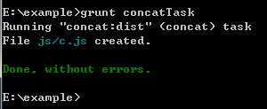

# 前端自动化工具-Grunt插件 CodeLab

*2014年6月7日*

本次活动主要介绍Grunt的环境搭建，常用插件的配置、使用以及综合能力训练。我们力求把所有步骤细化，做到浅显易懂。首先会介绍Grunt环境的搭建，包括NodeJS安装和环境配置；其次会单独介绍Grunt常用插件的用法和配置；最后以一个综合练习来熟悉插件之间的配合工作。在本次学习中可能会用到的工具如下：IDE（WebStorm或其他）、命令行工具、浏览器等。

##文章目录
- [1 环境搭建](#user-content-1-环境搭建)
    - [1.1 NodeJS安装](#user-content-11-nodejs安装)
    - [1.2 NodeJS环境变量设置](#user-content-12-nodejs环境变量设置)
    - [1.3 Grunt-cli安装](#user-content-13-grunt-cli安装)
    - [1.4 Grunt安装](#user-content-14-grunt安装)
- [2 常用Grunt插件介绍](#user-content-2-常用grunt插件介绍)
    - [2.1 grunt-contrib-concat](#user-content-21-grunt-contrib-concat)
    - [2.2 grunt-contrib-jshint](#user-content-22-grunt-contrib-jshint)
    - [2.3 grunt-contrib-uglify](#user-content-23-grunt-contrib-uglify)
    - [2.4 grunt-contrib-cssmin](#user-contnet-24-grunt-contrib-cssmin)
    - [2.5 grunt-contrib-copy](#user-content-25-grunt-contrib-copy)
    - [2.6 grunt-contrib-clean](#user-content-26-grunt-contrib-clean)
    - [2.7 grunt-contrib-connect](#user-content-27-grunt-contrib-connect)
    - [2.8 grunt-contrib-watch](#user-content-28-grunt-contrib-watch)
    - [2.9 grunt-bower-install](#user-content-29-grunt-bower-install)
    - [2.10 grunt-rev](#user-content-210-grunt-rev)
    - [2.11 grunt-usemin](#user-content-211-grunt-usemin)
    - [2.12 load-grunt-tasks](#user-content-212-load-grunt-tasks)
    - [2.13 time-grunt](#user-content-213-time-grunt)
- [3 综合练习](#user-content-3-综合练习)

## 1 环境搭建

Grunt和Grunt的插件都是通过Node.js的包管理器npm来安装和管理的,因此我们先安装NodeJS。
> Node.js是一个可以快速构建网络服务及应用的平台。该平台的构建是基于Chrome's JavaScript runtime，也就是说，实际上它是对Google V8引擎（应用于Google Chrome浏览器)进行了封装。

### 1.1 NodeJS安装

下载NodeJS。下载地址：[www.nodejs.org](http://www.nodejs.org)  
下载完后点击安装包进行NodeJS安装  


### 1.2 NodeJS环境变量设置

右键打开`计算机` -> `属性` -> `高级系统设置` -> `环境变量`，在PATH变量中添加下面两行(如果不存在)：
* C:\Users\jyun\AppData\Roaming\npm; (路径前缀根据当前用户而不同)
* C:\Program Files\nodejs;（默认安装路径）

安装完后我们验证一下版本。在命令行中输入`node -v && npm -v`，如果能看到相应的版本号，即安装成功。

### 1.3 Grunt-cli安装
Grunt-cli为Grunt命令行接口，因此需要安装在全局范围内。我们打开命令行工具，输入以下指令：
```
npm install -g grunt-cli
```
> NodeJS的包管理器npm的安装命令解释  
    **npm**: 包管理器指令  
    **install**: 安装  
    **-g**: 全局安装  
    **package_name**: 安装包名称  

ps: 在国内访问包管理仓库可能会出现连接不上的情况，可以使用国内的镜像地址 `http://r.cnpmjs.org`,修改方式如下：  
```
npm config set registry=http://r.cnpmjs.org
```

安装过程顺利的话，我们能看到如下结果：  
  
打开npm所在路径,可以看到生成了`grunt.cmd`:  


### 1.4 Grunt安装

上一步骤所安装的Grunt-cli能保证Grunt不同版本的兼容性,使得不同项目中的Grunt互不影响.接下来我们创建一个属于自己的项目:
* 创建新文件夹 `mkdir example`
* 进入该文件夹 `cd example`
* 执行`npm init`来初始化项目,根据提示完成初始化:
  * 输入项目名称(括号中为默认值)
  * 输入项目版本号(括号中为默认值)
  * 输入项目描述
  * 输入程序入口文件(括号中为默认值)
  * 输入测试执行命令
  * 输入Git目录
  * 输入项目关键字
  * 输入作者
  * 输入版权协议
  * 显示即将生成的package.json内容,是否确认生成?

完成以上步骤后,我们的项目配置文件就生成了.这里需要说明的是,我们为什么要用npm来创建我们的项目?npm就相当于一个代码仓库,你可以提交自己的项目,也可以使用别人提交的项目.这一切都需要包管理器来为我们服务,因此我们使用npm创建了自己的一个项目.当然你也可以自己手动创建`package.json  `  
接下来我们安装Grunt,和之前类似,在项目根路径下输入命令安装Grunt:
```
npm install grunt --save-dev
```

> npm的安装命令十分强大,可以根据不同的方式来安装  


grunt插件的安装我们用到了`--save-dev`参数,该参数会自动帮我们把Grunt插件添加到我们的项目依赖中,当然我们也可以不用这个参数,自己在`package.json`中添加依赖:
```
{
  ...
  "devDependencies": {
    "grunt": "^0.4.5"
  }
}
```
顺利安装完成,我们依然能看到正确的反馈:  
  
在根目录下会多出`node_modules`文件夹,里面包含了所有我们项目依赖的包

## 2 常用Grunt插件介绍
在grunt官网的插件列表中可以看到有非常多的插件,也正是这些插件赋予了Grunt无穷的魔力.下面介绍如何使用这些插件,一起来感受下Grunt带来的神奇.  
> `grunt-contrib-`前缀的为官方维护的插件,其余的为第三方社区或个人维护的插件.  

使用插件之前,我们先在项目根目录下创建`Gruntfile.js`.这是Grunt的配置文件,所有的Grunt插件都通过`Gruntfile.js`来进行配置:
```javascript
module.exports = function(grunt) {
  grunt.initConfig({
    pkg: grunt.file.readJSON('package.json')
  });
}
```

### 2.1 grunt-contrib-concat
grunt-contrib-concat用于合并文件,并支持添加头部注释和尾部注释,以及对原有注释的清除.  
* Step1 - 插件安装:  
```
npm install grunt-contrib-concat --save-dev
```

* Step2 - 我们在项目中创建js文件夹,并添加`a.js`和`b.js`:  

```
js/a.js
/**
 * this is a function
 */
function a(){
	alert('a');
}

js/b.js 
/**
 * this is b function
 */
function b(){
	alert('b');
}
```

* Step3 - 修改`Gruntfile.js`,添加contact配置:

```javascript

    grunt.initConfig({
		pkg: grunt.file.readJSON('package.json'),
		concat: {
			options: {
		      separator: ';',
		      stripBanners: true
		    },
			dist: {
				src: ['js/a.js', 'js/b.js'],
				dest: 'js/c.js'
			}
		}
	});
    grunt.loadNpmTasks('grunt-contrib-concat');

	grunt.registerTask('concatTask', ['concat']);

```
* Step4 - 执行`grunt concat`:



### 2.2 grunt-contrib-jshint

### 2.3 grunt-contrib-uglify

### 2.4 grunt-contrib-cssmin

### 2.5 grunt-contrib-copy

### 2.6 grunt-contrib-clean

### 2.7 grunt-contrib-connect

### 2.8 grunt-contrib-watch

### 2.9 grunt-bower-install

### 2.10 grunt-rev

### 2.11 grunt-usemin

### 2.12 load-grunt-tasks

### 2.13 time-grunt
